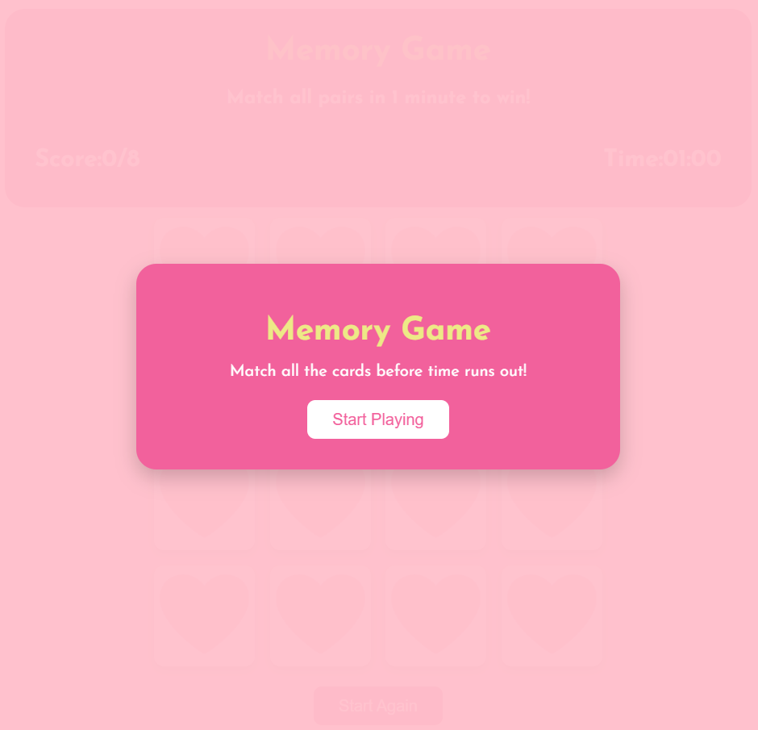
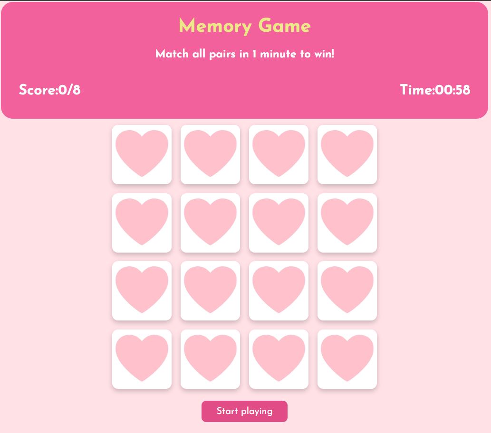
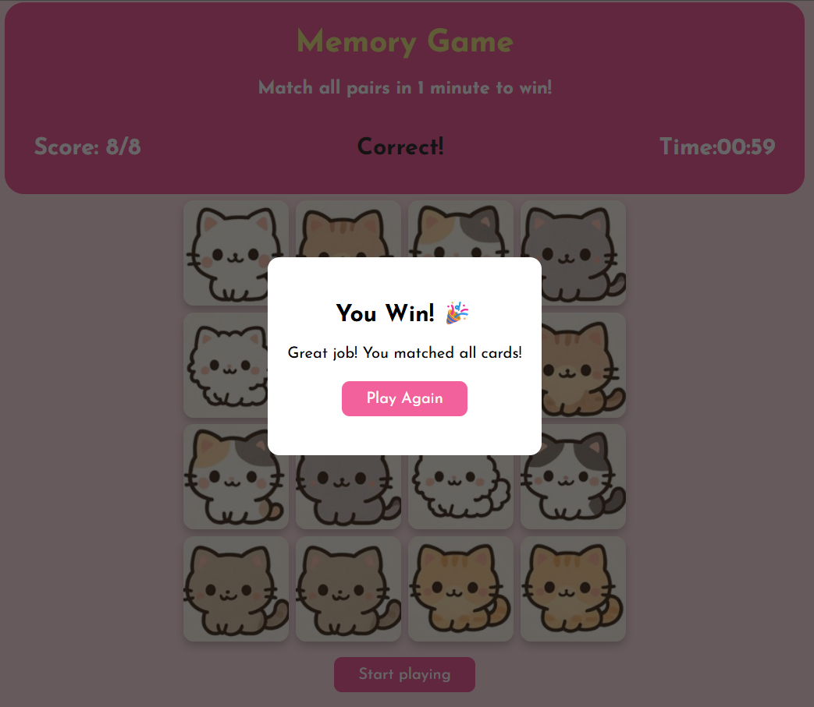
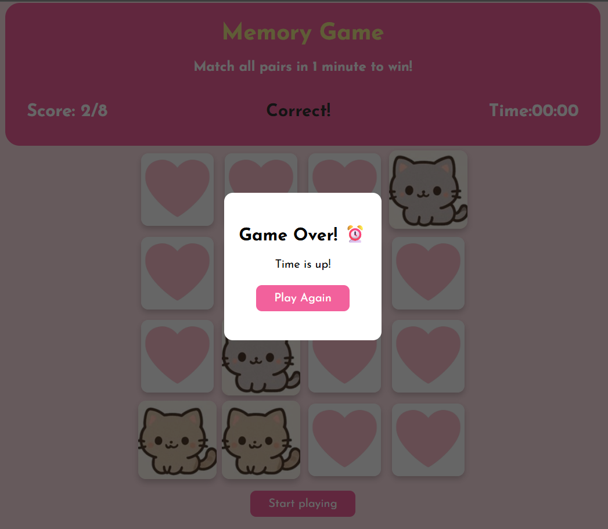

# Memory Game

## Technologies Used

* HTML
* CSS
* JavaScript

## Description

The Memory Game is an interactive card-matching game where players flip cards to find matching pairs within a limited time. The game challenges the player's memory and speed by requiring all pairs to be matched within 1 minute.

The game includes a timer, score tracking system, and a pop-up notification to display win or lose outcomes. It is designed with a clean and engaging user interface to enhance the player experience.

## User Stories
* As a player, I want to see a start screen so I can begin the game when I am ready.
* As a player, I want to click on cards to reveal their images so I can find matching pairs.
* As a player, I want the cards to flip back if they do not match so I can try again.
* As a player, I want to see my score update as I match pairs.
* As a player, I want a timer so I feel challenged to finish quickly.
* As a player, I want to receive feedback (win or lose) at the end of the game.
* As a player, I want to restart the game easily so I can play again.

## Screenshots

### Start Screen

Displayed when the game first loads. The player sees a centered start box with instructions and a “Start playing” button. The game does not begin until the player clicks the button.

### Game Setup

The main game interface after starting. All cards are placed face down, and the player can see the timer, score tracker, and reset button.

### Winning Screen 🎉

Displayed when the player successfully matches all card pairs within the time limit. A celebratory popup appears to congratulate the player on completing the game.

### Time’s Up ⏰

Shown when the countdown timer reaches zero before all matches are completed. A popup informs the player that the game is over and allows them to restart and try again.

## Future Enhancements

* Add difficulty levels (easy, medium, hard)
* Add sound effects and animations
* Improve mobile responsiveness
* Add leaderboard or high score tracking
* Add different themes

## Credits
- Instructors for guidance and support during the project
